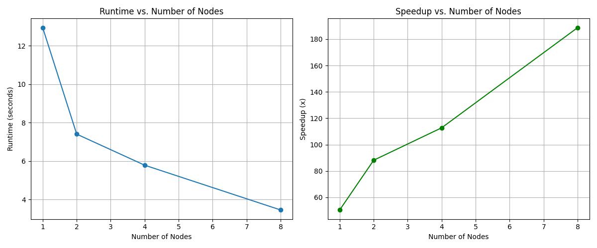

# Distributed Mandelbrot Painting with MPI and OpenMP


## Overview
This project explores hybrid parallelisation (MPI + OpenMP) of Mandelbrot-set rendering.  By distributing rows of the output image across multiple MPI ranks (inter-node parallelism) and further splitting each rank's work among CPU threads (intra-node parallelism), we achieve substantial speed-ups compared with a purely serial implementation.

The code generates a portable-anymap (`.pnm`) image which can be loss-lessly converted to PNG for viewing.

---
## Quick Start
```bash
# 1. Build both the serial and parallel binaries (requires mpic++, OpenMP)
make           # or: make all

# 2. Run the serial reference version
./mandelbrot-serial -f baseline.pnm

# 3. Run the hybrid MPI+OpenMP version
#    Example: 4 MPI ranks, 8 OpenMP threads per rank, 10k iterations, 4×AA
mpirun -np 4 env OMP_NUM_THREADS=8 ./mandelbrot-mpi -f mandelbrot.pnm -i 10000 -aa 4

# 4. Convert the output (choose one)
convert mandelbrot.pnm mandelbrot.png        # ImageMagick
# or
pnmtopng mandelbrot.pnm > mandelbrot.png     # Netpbm
```
The thread count can be changed at run-time by setting the `OMP_NUM_THREADS` environment variable—no recompilation needed.

---
## Command-line Flags
| Flag | Description | Default |
|------|-------------|---------|
| `-f` | Output filename (`.pnm` will be appended if not present) | `mandelbrot.pnm` |
| `-i` | Maximum iterations per pixel | `10000` |
| `-x`, `-y` | Centre of view in the complex plane | `-0.75`, `0.0` |
| `-z` | Zoom factor (> 1 zooms in) | `1.0` |
| `-aa` | Anti-aliasing samples per pixel (must be a square number) | `4` |

---
## Parallelisation Strategy
1. **Domain Decomposition (MPI)** – Image rows are block-distributed among ranks to minimise communication.
2. **Shared-memory Parallelism (OpenMP)** – Each rank performs a `#pragma omp parallel for` over its local rows.
3. **Collective I/O** – Ranks write directly to a single output file using `MPI_File_write_at`, avoiding a gather bottleneck.

---
## Performance Results (Extreme Cluster, 8 cores / node)
| Nodes | Runtime (s) | Speed-up (×) |
|:----:|:-----------:|:------------:|
| 1 | 12.94 | 50.41 |
| 2 | 7.40 | 88.15 |
| 4 | 5.79 | 112.76 |
| 8 | 3.46 | 188.74 |

<p align="center">
  
</p>

---
## Repository Contents
| File | Purpose |
|------|---------|
| `mandelbrot-serial.cc` | Baseline single-threaded implementation |
| `mandelbrot-mpi.cc` | Hybrid MPI + OpenMP implementation |
| `Makefile` | Builds both executables; `make clean` removes binaries & images |
| `mandelbrot.pbs` | PBS script used to submit jobs on *extreme* |
| `plot_performance.py` | Generates the performance plot above |
| `mandelbrot.txt` | In-depth write-up of the parallelisation and results |

---
## Regenerating the Plot
```bash
pip install matplotlib            # once, if needed
python plot_performance.py        # creates mandelbrot_performance.png
```

---
## License & Authorship
© 2024 Vishal Reddy Vaka.  Released for educational use.

---
## Acknowledgements
Thanks to Professor Dr. Michael Papka and the CS department for providing the starter code and access to the *extreme* HPC cluster.